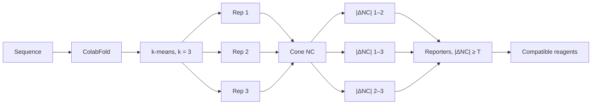

# ColabFold + Rosetta Cone-NC + Pairwise ΔNC Covalent-Labeling Pipeline

Given a protein sequence, this pipeline builds three alternative structural
models, scores every residue with Rosetta cone neighbor count (NC), and lists
covalent-labeling sites whose NC differs enough between models to be useful
experimentally.



Default **T = 5**. Pair 1–2, 1–3, and 2–3 are kept separate.

ROSIE / cluster jobs use `job.json` and `entrypoint.sh` (`--workdir`, `--input`, `--ncpus`).

---

## 1. Docker / ROSIE input interface

The cluster-facing Docker interface uses a JSON job description.

The container is run as:

```bash
docker run --rm \
  -v /path/to/data:/data \
  colabfold-rosetta-pipeline \
  --workdir /data/output \
  --input /data/job.json \
  --ncpus 32
```

The three required command-line arguments are:

| Argument | Description |
|----------|-------------|
| `--workdir` | Working directory. All pipeline output is written under this directory. |
| `--input` | Path to the `job.json` file describing the protein and ColabFold job. |
| `--ncpus` | Number of CPU cores available to the container. |

The Docker image uses `entrypoint.sh` as its entrypoint, so these arguments are
passed directly to the pipeline.

---

## 2. `job.json` schema

A job is described by a JSON object.

Example:

```json
{
  "job_id": "A0A075Q0W3",
  "sequence": "MKTIIALSYIFCLVFADYKDDDDK",
  "num_seeds": 1000,
  "models_per_seed": 5
}
```

### Required fields

#### `job_id`

```json
"job_id": "A0A075Q0W3"
```

String used as the identifier for the job and as the prefix for output files.

Internally, this value is stored as `UNIPROT`.

Although UniProt accessions are used for the benchmark data set, the pipeline
primarily treats this value as a job/protein identifier.

Using a short filename-safe identifier is recommended.

#### `sequence`

```json
"sequence": "MKTIIALSYIFCLVFADYKDDDDK"
```

The protein sequence as a plain one-letter amino-acid sequence.

This field is not a FASTA file and should not contain a FASTA header.

Correct:

```text
MKTIIALSYIFCLVFADYKDDDDK
```

Incorrect:

```text
>protein_name
MKTIIALSYIFCLVFADYKDDDDK
```

The pipeline converts the sequence to FASTA internally before running ColabFold.

#### `num_seeds`

```json
"num_seeds": 1000
```

Number of random ColabFold seeds to sample.

The total number of candidate models is approximately:

```text
num_seeds × models_per_seed
```

For example:

```text
1000 seeds × 5 models/seed ≈ 5000 candidate structures
```

#### `models_per_seed`

```json
"models_per_seed": 5
```

Number of AlphaFold model parameterizations evaluated for each seed.

The current ColabFold wrapper accepts values from 1 to 5.

For the benchmark workflow, five models per seed can be combined with 1000 seeds
to generate approximately 5000 candidate structures.

### Optional legacy fields

The input parser also accepts:

```json
{
  "labels_source": "",
  "labels_dir": ""
}
```

These fields are associated with the older Step 4 labeling-decision workflow.

They are not required for the primary pairwise ΔNC workflow described below.

The legacy workflow is disabled by default.

The reporter threshold is **not** currently a JSON field. It is the environment
variable `PAIRWISE_THRESHOLD` (default `5`). See [§15](#15-runtime-parameters).

---

## 3. Input preparation

The first internal program is:

```text
pipeline_steps/00_prepare_input.py
```

It reads `job.json` and verifies that the following fields are present:

- `job_id`
- `sequence`
- `num_seeds`
- `models_per_seed`

It then creates:

```text
<workdir>/input.fasta
<workdir>/job_meta.env
```

For example, the sequence:

```json
{
  "job_id": "P12345",
  "sequence": "MKTLLV..."
}
```

is converted internally to:

```text
>P12345
MKTLLV...
```

The metadata file contains values used by the remaining pipeline steps, including:

- `UNIPROT`
- `NUM_SEEDS`
- `MODELS_PER_SEED`
- `LABELS_SOURCE`
- `LABELS_DIR`

The user therefore does not need to generate a FASTA file separately when using
the JSON/ROSIE interface.

---

## 4. ColabFold candidate-structure generation

Structure generation is performed by:

```text
pipeline_steps/01_run_colabfold_batch.py
```

ColabFold generates multiple alternative computational structures from the input
protein sequence.

For each worker, the program calls `colabfold_batch` using the requested number
of random seeds and AlphaFold models per seed.

The cluster entrypoint currently also passes:

```text
--max-msa 16:32
--use-dropout
```

to ColabFold.

These settings are used to promote sampling of structurally distinct predictions.

Predicted structures are written under:

```text
<workdir>/colabfold/
```

The directory may contain `*.pdb`, `*.json`, and `*.a3m` files generated by
ColabFold.

---

## 5. Parallel execution

The cluster entrypoint distributes ColabFold calculations across multiple CPU
workers.

```text
NUM_WORKERS = NCPUS / THREADS_PER_WORKER
```

The image default is `THREADS_PER_WORKER=1` (32 workers on 32 CPUs).
JAX/AlphaFold on CPU does not use 8 OpenMP threads well, so fat workers leave
most of `--ncpus` idle while cutting the number of independent seed jobs in
flight. Do not treat CPU percent as the score; compare wall-clock time.

Raise it only if memory is the binding constraint -- fewer, fatter workers
lower peak RAM, which matters for large targets where each worker needs
several GB:

```text
-e THREADS_PER_WORKER=2   # 16 workers on 32 CPUs
-e THREADS_PER_WORKER=8   # 4 workers on 32 CPUs, lowest peak RAM
```

Seeds are split exactly. No worker is given `ceil(NUM_SEEDS / NUM_WORKERS)`
if that would overshoot. For 300 seeds and 32 workers:

```text
12 workers × 10 seeds
20 workers × 9 seeds
total = 300 seeds
× models_per_seed 5 = 1500 models
```

Existing Docker images keep the old 8-thread default unless
`THREADS_PER_WORKER` is set. Rebuild after merging to main.

Each worker writes its results into:

```text
colabfold/worker_0/
colabfold/worker_1/
...
```

After all workers finish, their PDB, JSON, and A3M files are collected into the
main `colabfold/` directory.

The current cluster entrypoint forces ColabFold to use CPU execution by setting:

```text
JAX_PLATFORMS=cpu
CUDA_VISIBLE_DEVICES=""
```

and uses CPU affinity (`taskset`) to assign cores to individual workers.

### CPU allocation

Worker pinning uses the CPUs the process is actually allowed to run on
(`os.sched_getaffinity`), not `0 .. ncpus-1`. Under SGE/SLURM a job's cpuset is
frequently a non-zero-based range such as `40-51`; assuming `0..N-1` there makes
every `taskset` call fail with `Invalid argument`. The allocated set is printed
at startup:

```text
ALLOWED_CPUS=40 41 42 43 44 45 46 47 48 49 50 51
```

If `--ncpus` is larger than that set, it is clamped with a warning instead of
failing. If `taskset` is unavailable, workers run unpinned.

### Shared MSA

The MSA is built once, before the workers start, and every worker is handed the
resulting `.a3m`:

```text
[MSA] building shared MSA (--msa-only)
[MSA] workers reuse <workdir>/msa/<job>.a3m (0 per-worker MSA queries)
```

Previously each worker ran `colabfold_batch` on the FASTA and independently
queried the MMseqs2 API for the same sequence, which is `NUM_WORKERS - 1`
redundant lookups and a common cause of rate-limiting. A rerun reuses an
existing `msa/*.a3m` and skips the lookup entirely. ColabFold builds without
`--msa-only` fall back to a single 1-seed/1-model pass, which yields the same
`.a3m`.

### Worker failures

If a worker exits non-zero the run reports which one, tails its log, and still
consolidates the surviving predictions into `colabfold/` before exiting, so a
partial run can be resumed with `SKIP_COLABFOLD=1`.

---

## 6. Structural comparison and representative selection

The next step is:

```text
pipeline_steps/02_plddt_rmsd_kmeans.py
```

The purpose of this step is to reduce the large number of ColabFold candidate
structures to three representative structural hypotheses.

This GitHub execution path does **not** currently apply a DSSP / secondary-structure
filter. Clustering is performed on the ColabFold PDBs collected in `colabfold/`.

### 6.1 Mean pLDDT

For each predicted PDB structure, mean pLDDT is calculated from the Cα atom
B-factor field.

The candidate with the highest mean pLDDT is selected as an internal structural
reference.

This structure is used only as a common reference for structural comparison.
Selection as the reference does not imply that it represents the native state.

### 6.2 Cα RMSD calculation

Each candidate structure is compared with the internal reference using Cα RMSD
after optimal rigid-body superposition.

The superposition is performed using the Kabsch algorithm.

Each candidate is therefore represented by:

```text
RMSD(candidate, internal reference)
```

### 6.3 k-means clustering

The internal reference itself is excluded from clustering.

The RMSD-to-reference values of the remaining candidate structures are grouped
into three clusters using one-dimensional k-means clustering:

```text
k = 3
```

The clusters are ordered by increasing cluster-center RMSD.

Thus:

```text
Cluster 1 → Rep 1
Cluster 2 → Rep 2
Cluster 3 → Rep 3
```

### 6.4 Representative selection

Within each cluster, the candidate structure with the highest mean pLDDT is
selected as that cluster's representative.

Representative selection applies no pLDDT floor by default, so a cluster that is
far from the reference may be a badly-folded model rather than an alternative
conformation. Step 2 warns when a chosen representative falls below mean pLDDT
70 (`--warn-plddt`), and `--min-plddt` drops low-confidence models before
clustering. The default of `0` keeps previous results reproducible.

The output is therefore three alternative computational structures:

- Rep 1
- Rep 2
- Rep 3

Important output files include:

```text
analysis/<UID>_plddt_rmsd_bestref.tsv
analysis/<UID>_rep_info.tsv
analysis/<UID>_plddt_vs_rmsd_bestref.png
```

`<UID>_rep_info.tsv` contains the PDB path, mean pLDDT, RMSD to the reference,
cluster assignment, and representative identifier for the three selected
structures.

---

## 7. Rosetta neighbor-count calculation

Residue-level structural environments are evaluated using:

```text
pipeline_steps/03_run_rosetta_nc.py
```

The program runs Rosetta's `per_residue_solvent_exposure` application
independently on Rep 1, Rep 2, and Rep 3.

The default solvent-exposure method is:

```text
cone
```

which is requested with:

```text
-solvent_exposure:method cone
```

The currently specified distance parameters are:

```text
-dist_midpoint 9.0
-dist_steepness 1.0
```

The script also supports `--method sphere` for testing or comparison, although
cone is the default for the primary workflow.

The cone angular parameters are not explicitly overridden by the current script
and therefore follow the values supplied by the installed Rosetta implementation.

### Interpretation of NC

The neighbor-count value provides a measure of the local packing environment
around a residue.

In general:

```text
lower NC  → fewer neighboring atoms / relatively more exposed
higher NC → more neighboring atoms / relatively more buried
```

NC is treated as a continuous structural descriptor.

The pipeline does not require an absolute exposed-versus-buried cutoff in the
primary pairwise workflow.

### Rosetta output

The three representative NC results are combined into:

```text
rosetta/<UID>_rosetta_nc.tsv
```

with columns including:

```text
chain
resnum
resname
nc_rep1
nc_rep2
nc_rep3
```

Example:

```text
chain   resnum   resname   nc_rep1   nc_rep2   nc_rep3
A       50       LYS       8.2       15.7      9.4
A       51       GLU       11.1      12.0      18.3
```

---

## 8. Pairwise ΔNC analysis

The primary reporter-identification step is:

```text
pipeline_steps/05_pairwise_delta_nc.py
```

Reporter identification is performed independently for the three possible
representative comparisons:

- Rep 1 vs Rep 2
- Rep 1 vs Rep 3
- Rep 2 vs Rep 3

For residue *i*, the program calculates:

```text
ΔNC(1,2) = |NC_rep1 - NC_rep2|
ΔNC(1,3) = |NC_rep1 - NC_rep3|
ΔNC(2,3) = |NC_rep2 - NC_rep3|
```

For example:

```text
NC_rep1 = 8
NC_rep2 = 16
NC_rep3 = 10
```

gives:

```text
Rep1–Rep2: |8 - 16| = 8
Rep1–Rep3: |8 - 10| = 2
Rep2–Rep3: |16 - 10| = 6
```

---

## 9. Reporter threshold

The default reporter threshold is:

```text
|ΔNC| >= 5
```

and is controlled through:

```text
PAIRWISE_THRESHOLD
```

The default value is:

```text
PAIRWISE_THRESHOLD=5
```

A residue is evaluated independently for each representative pair.

Using the previous example:

```text
Rep1–Rep2 ΔNC = 8   → reporter for Rep1–Rep2
Rep1–Rep3 ΔNC = 2   → not a reporter for Rep1–Rep3
Rep2–Rep3 ΔNC = 6   → reporter for Rep2–Rep3
```

Therefore, a residue can be informative for one pair, two pairs, or all three
pairs. The pair assignments are retained separately.

The threshold is a practical operating threshold and should not be interpreted as
an experimentally calibrated detection limit.

---

## 10. Direction of the NC difference

For each pairwise comparison, the pipeline also records which representative has
the lower NC value.

For example:

```text
Rep1 NC = 8
Rep2 NC = 16
```

results in:

```text
more_exposed_in_12 = rep1
```

because Rep 1 has the lower NC value.

This should be interpreted as: Rep 1 places the residue in a relatively more
exposed local environment.

It should not be interpreted as a deterministic prediction that the residue will
or will not be experimentally labeled.

Experimental labeling can additionally depend on intrinsic side-chain
reactivity, local chemical environment, reagent concentration, reaction time,
and other experimental conditions.

---

## 11. Residue-to-reagent mapping

Reporter residues are mapped to compatible covalent-labeling reagents using:

```text
pipeline_steps/reagent_map.py
```

The lookup contains both residue-selective and broadly reactive labeling
approaches.

The primary scientific output is the **full compatible-reagent list** for each
reporter residue. Step 5 also still writes a convenience `preferred_reagent`
column (first name in the lookup order) and a `best_per_pair` pick. Those are
not required for interpreting the complete reporter tables.

### Residue-selective examples

- His → DEPC, NBS, iodine
- Lys → DEPC, N-acetylimidazole, acetic anhydride, succinic anhydride, maleic anhydride, S-methylthioacetimidate
- Cys → DEPC, iodoacetamide/iodoacetate, acryloyl
- Ser → DEPC
- Thr → DEPC
- Tyr → DEPC, N-acetylimidazole, NBS, tetranitromethane, iodine
- Asp/Glu → EDC/GEE
- Arg → phenylglyoxal, p-hydroxyphenylglyoxal, 2,3-butanedione, 1,2-cyclohexanedione, methylglyoxal, kethoxal
- Trp → NBS, HNB bromide, NPS-Cl

The complete mapping and literature basis should be documented in the
corresponding Supporting Information table.

### Broadly reactive approaches

The current lookup also includes:

- OH-high
- OH-medium
- OH-low
- diazirine
- CF3

The hydroxyl-radical groups are operational high-, medium-, and low-reactivity
bins based on published intrinsic amino-acid reactivities.

Current groups are:

```text
OH-high:   Cys, Met, Trp, Tyr, Phe, His, Leu, Ile, Arg
OH-medium: Lys, Val, Ser, Thr, Pro, Gln, Glu
OH-low:    Asp, Asn, Ala, Gly
```

Diazirine and CF3 are currently mapped to all 20 standard amino acids as broad
operational mappings for the pipeline.

These mappings should not be interpreted as implying equal experimental
reactivity for every amino acid.

---

## 12. Pairwise result files

The main results are written to:

```text
<workdir>/pairwise/
```

### `<UID>_all_residues_with_pair_diffs.tsv`

Contains all residues, regardless of whether they pass the reporter threshold.

Important fields include:

- `nc_rep1`, `nc_rep2`, `nc_rep3`
- `d12`, `d13`, `d23`
- `more_exposed_in_12`, `more_exposed_in_13`, `more_exposed_in_23`
- reagent annotations (`reagents`, `preferred_reagent`, `reagent_tier`)

This file is useful for inspecting the complete residue-level structural data.

### Pair ranking tables

- `<UID>_rank_rep1_vs_rep2.tsv` — residues ranked by `|NC_rep1 - NC_rep2|`
- `<UID>_rank_rep1_vs_rep3.tsv` — residues ranked by `|NC_rep1 - NC_rep3|`
- `<UID>_rank_rep2_vs_rep3.tsv` — residues ranked by `|NC_rep2 - NC_rep3|`

The three ranking tables are intentionally kept separate because each represents
a distinct structural comparison.

### `<UID>_residues_dNC_ge_5.tsv`

Contains the union of residues that satisfy the selected threshold for at least
one representative comparison.

For each residue, the file records whether it passes the threshold for:

- Rep1–Rep2
- Rep1–Rep3
- Rep2–Rep3

A residue can therefore appear once in this table while being associated with
multiple representative comparisons.

The exact filename changes if a threshold other than 5 is selected
(`<UID>_residues_dNC_ge_<T>.tsv`).

### `<UID>_above_threshold_residues.tsv`

An additional copy of the above-threshold reporter table written using a
threshold-independent filename.

### `<UID>_reagent_residue_detail.tsv`

Expands the reporter-residue information into reporter/reagent combinations.

If one reporter residue can be targeted by several compatible labeling reagents,
the output contains a separate reagent-residue relationship for each compatible
reagent.

### `<UID>_reagent_target_counts.tsv`

Summarizes reporter availability for every compatible reagent.

The table contains:

- `reagent`
- `Total_targetable_unique_residues`
- `Rep_1-2`
- `Rep_2-3`
- `Rep_1-3`
- `Pairs_covered`
- `Tier`

`Total_targetable_unique_residues` is the number of unique reporter residues
compatible with the reagent.

It is not the total number of amino acids in the protein that could theoretically
react with that reagent.

The pair-specific columns report how many compatible reporter residues satisfy
the ΔNC threshold for the corresponding representative comparison.

Because the same residue may be informative for more than one representative
pair, the three pair-specific counts should not be added together and interpreted
as a unique-residue count.

---

## 13. Auxiliary per-pair recommendation outputs

The current implementation also generates:

```text
<UID>_best_per_pair.tsv
<UID>_per_pair_recommendation.txt
```

These are convenience outputs that select a highly ranked reporter for each
representative pair.

They are not required for interpreting the complete reporter tables, which retain
all residues satisfying the selected pairwise threshold.

For applications where all compatible reporter residues should be presented
without choosing a single preferred reporter or reagent, the full pairwise and
reagent-target tables should be treated as the primary outputs.

---

## 14. Output directory structure

A typical job produces:

```text
output/
│
├── input.fasta
├── job_meta.env
│
├── colabfold/
│   ├── worker_0/
│   ├── worker_1/
│   ├── ...
│   ├── *.pdb
│   ├── *.json
│   └── *.a3m
│
├── analysis/
│   ├── <UID>_plddt_rmsd_bestref.tsv
│   ├── <UID>_rep_info.tsv
│   └── <UID>_plddt_vs_rmsd_bestref.png
│
├── rosetta/
│   ├── <UID>_rep_cluster1_neighbor_count_cone.out
│   ├── <UID>_rep_cluster2_neighbor_count_cone.out
│   ├── <UID>_rep_cluster3_neighbor_count_cone.out
│   └── <UID>_rosetta_nc.tsv
│
├── pairwise/
│   ├── <UID>_all_residues_with_pair_diffs.tsv
│   ├── <UID>_residues_dNC_ge_5.tsv
│   ├── <UID>_above_threshold_residues.tsv
│   ├── <UID>_rank_rep1_vs_rep2.tsv
│   ├── <UID>_rank_rep1_vs_rep3.tsv
│   ├── <UID>_rank_rep2_vs_rep3.tsv
│   ├── <UID>_reagent_residue_detail.tsv
│   ├── <UID>_reagent_target_counts.tsv
│   ├── <UID>_best_per_pair.tsv
│   └── <UID>_per_pair_recommendation.txt
│
└── decision/
```

The `decision/` directory is associated with the legacy Step 4 workflow and is
normally empty when the primary pairwise workflow is used.

---

## 15. Runtime parameters

The JSON/cluster entrypoint supports the following environment variables:

| Variable | Default | Description |
|----------|---------|-------------|
| `THREADS_PER_WORKER` | 1 | CPU threads per ColabFold worker. Default 1 so `--ncpus` is filled with independent seed jobs. Raise to 2 or 8 if RAM is the limit. Clamped down if it exceeds the usable CPU count. |
| `COLABFOLD_BIN` | `colabfold_batch` | ColabFold executable used for both the shared-MSA pass and the workers. |
| `ROSETTA_BIN` | image-provided path (`/opt/rosetta-bin` in the Dockerfile) | Path to Rosetta `per_residue_solvent_exposure`. |
| `NC_METHOD` | `cone` | Rosetta neighbor-count method. May be `cone` or `sphere`. |
| `PAIRWISE_THRESHOLD` | `5` | Minimum absolute pairwise ΔNC required for reporter designation. |
| `RUN_LEGACY_DECISION` | `0` | Set to `1` to additionally run the older Step 4 decision workflow. |

Example:

```bash
docker run --rm \
  -v /path/to/data:/data \
  -e PAIRWISE_THRESHOLD=5 \
  -e NC_METHOD=cone \
  colabfold-rosetta-pipeline \
  --workdir /data/output \
  --input /data/job.json \
  --ncpus 32
```

---

## 16. Legacy Step 4

The repository retains:

```text
pipeline_steps/04_labeling_decision_pipeline_all_in_one.py
```

for backward compatibility.

This is the older absolute exposed/buried decision workflow and is not run by
default.

To run it in addition to the pairwise workflow:

```bash
-e RUN_LEGACY_DECISION=1
```

The primary workflow is Step 5:

```text
05_pairwise_delta_nc.py
```

which performs the pairwise ΔNC analysis described above.

---

## 17. Docker image contents

The Docker image is based on:

```text
ghcr.io/sokrypton/colabfold:1.5.3-cuda12.2.2
```

The image installs the Python dependencies listed in `requirements.txt` and
installs Rosetta through the Rosetta conda channel during the Docker build.

The `per_residue_solvent_exposure` executable is resolved during the build and
linked to:

```text
/opt/rosetta-bin
```

The following workflow scripts are copied into the image:

- `pipeline_steps/`
- `entrypoint.sh`
- `run_pipeline.sh`
- `run_from_predictions.sh`

For ROSIE/shared-cluster execution, `entrypoint.sh` with `job.json` should be
treated as the primary interface.

---

## 18. Building the image

Clone the repository:

```bash
git clone https://github.com/nematiaram/colabfold-rosetta-pipeline.git
cd colabfold-rosetta-pipeline
```

Build:

```bash
docker build -t colabfold-rosetta-pipeline .
```

Then run the JSON-based workflow:

```bash
docker run --rm \
  -v /path/to/data:/data \
  colabfold-rosetta-pipeline \
  --workdir /data/output \
  --input /data/job.json \
  --ncpus 32
```

---

## 19. Running from existing predictions

The repository also contains:

```text
run_from_predictions.sh
```

for development or testing when ColabFold predictions already exist.

The script expects:

```text
<workdir>/colabfold/*.pdb
```

and skips the ColabFold-generation step before continuing with clustering,
Rosetta NC, and pairwise analysis.

The JSON `entrypoint.sh` workflow should remain the primary interface for ROSIE.

---

## 20. Scientific interpretation

The pipeline is designed to identify experimentally accessible measurements
that can distinguish among alternative computational structures.

The three representatives should therefore be interpreted as alternative
structural hypotheses rather than as a thermodynamic conformational ensemble.

Reporter residues are selected because their local packing environments differ
between particular representative structures.

The pipeline does not attempt to predict an experimentally observed labeling
outcome solely from NC.

Instead, it provides:

- which residues show substantial model-dependent differences in local structural environment;
- which representative comparison or comparisons each residue informs;
- which representative has the relatively more exposed environment for a given pair; and
- which covalent-labeling chemistries are compatible with the reporter residue.

The experimental user can then choose labeling chemistry and measure the
corresponding residues to obtain information that helps discriminate among the
alternative structural models.

---

## 21. Current implementation notes

The primary JSON/ROSIE workflow currently consists of:

```text
00_prepare_input.py
        ↓
01_run_colabfold_batch.py
        ↓
02_plddt_rmsd_kmeans.py
        ↓
03_run_rosetta_nc.py
        ↓
05_pairwise_delta_nc.py
```

Step 4 is retained only as an optional legacy workflow.

Notes that are true of the current code and should be kept in mind for ROSIE
and for manuscript reproduction:

- **`job.json` does not contain the reporter threshold.** `PAIRWISE_THRESHOLD=5`
  is an environment variable. If a webserver should let users change it, add
  `"pairwise_threshold": 5` to the JSON schema.
- **DSSP filtering is not in this GitHub execution path.** Clustering currently
  takes ColabFold PDBs directly.
- **Step 5 still writes `preferred_reagent` and `best_per_pair` convenience
  fields.** The primary mapping is all compatible reagents (`reagents` /
  `reagent_residue_detail.tsv` / `reagent_target_counts.tsv`).
- **The cluster entrypoint sets `--max-msa 16:32` and `--use-dropout`, but does
  not currently pin `max_recycles=1` or `alphafold2_ptm`.** If those are part of
  the final manuscript method, they should be pinned in `entrypoint.sh`.
- **Cone angular settings are not explicitly passed.** The script pins
  `dist_midpoint=9.0` and `dist_steepness=1.0` and uses Rosetta defaults for
  the remaining cone parameters.

---

## 22. Main user-facing results

For a webserver implementation, the most useful results to display are:

### Representative structures

Rep 1, Rep 2, and Rep 3, with downloadable PDB structures and associated
pLDDT/RMSD information.

### Pair-specific reporter tables

For each of Rep 1 vs Rep 2, Rep 1 vs Rep 3, and Rep 2 vs Rep 3, display:

- Residue
- NC in representative A
- NC in representative B
- |ΔNC|
- relatively more exposed representative
- compatible labeling reagents

### Reagent summary

For each reagent, display:

- Reagent
- Unique compatible reporter residues
- Number of reporters for Rep1–Rep2
- Number of reporters for Rep1–Rep3
- Number of reporters for Rep2–Rep3

This preserves the pair-specific structural information and allows a user to
select a covalent-labeling experiment according to the structural ambiguity that
needs to be resolved.
